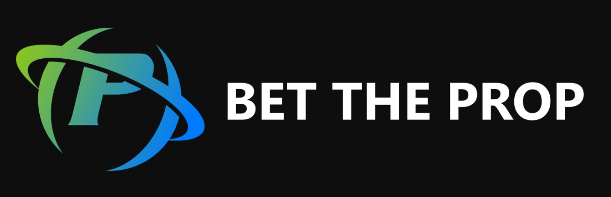
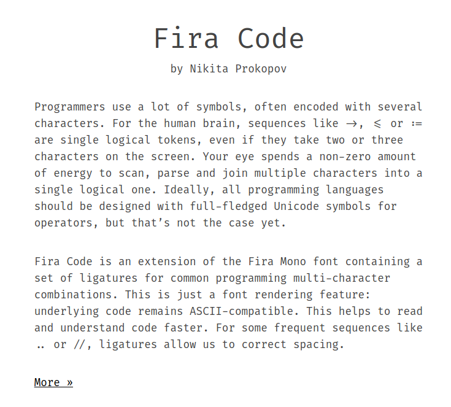
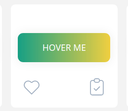
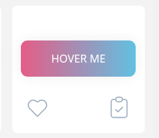

# jeremymorrison.ca

## Inspiration

### Colour Schemes

Colour gradient on this logo:

Would pair well with white background and grey accents.

The background and "code" style font from this site:

### Fonts

I like the idea of doing a code-style monospaced font

Landing page text can be animated like so:

### Websites

[This guy's landing page][jessygrossi], particularly how the image / text / nav bar are animated.

[Simple example of scrolling single page website][borstein]. My nav bar elements modelled off his as well.

## Big Picture

- single page website with scroll, so that when you click an element on the nav bar it just scrolls down (second website above scroll example)
- the idea is that it is basically an animated, extended resume, with similar sections to my resume
- thinking either white background with accents like colour schemes above, or something more creative like [fairlay.com][fairlay], where the background stays static and content scrolls on top of it, like what I did with [deaf-fire-art.ca][deaf-fire-art]
- nav bar on top instead of side like my [current website][me]
- each project will have a description similar to current website's [individual project descriptions][me project] (styling sucks)
  - maybe there is a better way to do this

navbar elements:

- about
- projects (drop down menu like [fairlay.com][fairlay])
- experience (job description)
- skills (like [Andrew Borstein's website][borstein])
- articles
- contact
- resume (hard link to pdf)

Not sure what to do about the project page. Each project description could be part of scroll, or it can be its own 'sub-page' like my [current website][me project landing].

Complex background will require simple features. Undecided on which to choose.

## Issues

### Simple background vs complex background

If I use a single colour as a background, I can have more interesting features like gradient buttons:

### Portrait

How to include my picture on the landing page without it looking corny?

### Short page sections

How to handle short page sections - see [current website's][me] stupid sections that are just icons.

### Overlays on image / CSS art background

See [current website's project page here][me project]

This looks horrible, but what's the solution to overlaying a video / text / more images on top of a complex background without resorting to something really ugly like this white box? If I use a white background, it's easy to just fill in text wherever I need it.

### How to demonstrate my projects

Currently I have a description + video (see current website project descriptions) but I kind of hate it. Is there some other way? Just linking to the website doesn't tell the whole story.

### Mixing fonts

Display font vs content fonts?

[me]: http://jeremymorrison.ca/#/
[me project]: http://jeremymorrison.ca/#/portfolio/deaf-fire-art
[me project landing]: http://jeremymorrison.ca/#/portfolio
[jessygrossi]: https://jessygrossi.com/
[borstein]: https://andrewborstein.com/
[fairlay]: https://fairlay.com/
[deaf-fire-art]: http://www.deaf-fire-art.ca/gallery
